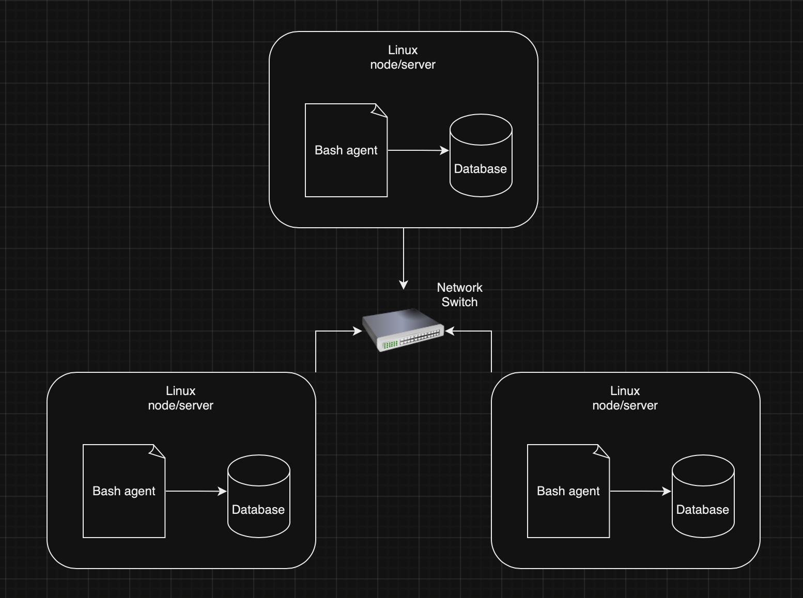

# Introduction
Linux Cluster Administration (LCA) teams manage clusters of multiple Linux nodes/servers. LCA teams use server specific information such as hardware specifications and resource usage for future resource planning purposes. The teams need a tool to retrieve and record this information from the cluster. This project aims to automate the collection and monitoring of hardware specifications and resource usage for nodes/servers within the cluster. The collected data is stored in a database, enabling efficient storage and retrieval. The technologies used to implement this solution include Bash scripting, PostgreSQL, Docker, and Git. This integration of data collection and data storage, provides a comprehensive overview of cluster health and resource utilization. This system supports informed decision-making for resource planning, ensuring optimal performance and scalability of the cluster. 

# Quick Start
1. Start a psql instance using psql_docker.sh `./scripts/psql_docker.sh create postgres password`
2. Create tables using ddl.sql `psql -h localhost -U postgres -d host_agent -f sql/ddl.sql`
3. Insert hardware specs data into the DB using host_info.sh `./scripts/host_info.sh "localhost" 5432 "host_agent" "postgres" "password"`
4. Insert hardware usage data into the DB using host_usage.sh `./scripts/host_usage.sh "localhost" 5432 "host_agent" "postgres" "password"`
5. Crontab setup
   ```
   bash> crontab -e
   * * * * * bash $(pwd)/scripts/host_usage.sh localhost 5432 host_agent postgres password > /tmp/host_usage.log
   ```

# Implemenation
Firstly, a PostgreSQL instance was provisioned using Docker. I then connected to this instance using the psql CLI and created a database, `host_agent`. I automated the creation of the two database tables, `host_info` and `host_usage` using a DDL file. The `host_info.sh` script automates the collection and storage of hardware specifications to the database. The `host_usage.sh` script automates the collection and storage of resource usage data to the database. Since the resource usage is something the LCA teams want to continuously monitor, `crontab` is used to configure a continuous job that executes the `host_usage.sh` periodically.
## Architecture


## Scripts
- psql_docker.sh: Create/start/stop a PostgreSQL Docker container.
  ```
  ./scripts/psql_docker.sh start|stop|create [psql_user][psql_password]
  ```
- host_info.sh: Retrive system hardware specifications and insert this to the database table
  ```
  ./scripts/host_info.sh psql_host psql_port db_name psql_user psql_password
  ```
- host_usage.sh: Retrive system resource usage information and insert this to the database table
  ```
  ./scripts/host_usage.sh psql_host psql_port db_name psql_user psql_password
  ```
- crontab: Used to automate the monitoring of host resource information every minute

## Database Modeling
The following shows the model of both the tables in our database.
- `host_info`
```
| id  | hostname | cpu_number | cpu_architecture | cpu_model | cpu_mhz   | l2_cache  | timestamp | total_mem |
|-----|----------|------------|------------------|-----------|-----------|-----------|-----------|-----------|
|     |          |            |                  |           |           |           |           |           |
```
- `host_usage`
```
| host_id  | memory_free | cpu_idle | cpu_kernel | disk_io | disk_available |
|----------|-------------|----------|------------|---------|----------------|
|          |             |          |            |         |                | 
```

# Test
Users can test this implementation by querying the database tables to view the data. Populated tables verify that the scripts are running correctly.
```
psql -h localhost -U psql_user -W
postgres=# \c host_agent;
postgres=# SELECT * FROM host_info;
postgres=# SELECT * FROM host_usage;
```

# Deployment
The agent script host_usage.sh is sceduled to run every minute using crontab. The source code for the implementation is stored on Github. Docker was used to create the PostgreSQL database.

# Improvements
- Extend the data being extracted for hardware specifications to include other important information such as motherboard details, etc.
- Create a sql file to query the database tables. This would help the user easily verify the data without having to manually run the queries themselves.
- Create a script that automates the configuration of the crontab for the user.
